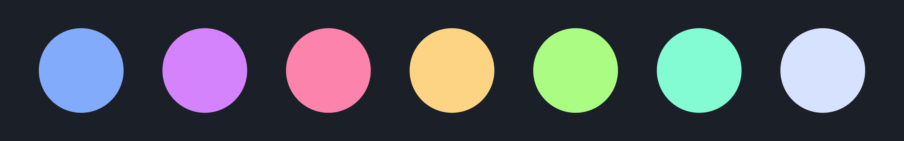

# Lapis Theme • Visual Studio Code

A dark blue theme for Visual Studio Code using a complimentary color palette for syntax:

 

There are several theme variations with different **accent and button colors** from the palette:

 

 

Additionally, each variant has a **Stealth Version** where the inactive tabs and project tree have a lower contrast:

 

 

# Installation

1.  Install [Visual Studio Code](https://code.visualstudio.com/)
2.  Launch Visual Studio Code
3.  Choose **Extensions** from menu
4.  Search for `lapis`
5.  Click **Install** to install it
6.  Click **Reload** to reload the Code
7.  From the menu bar click: Code > Preferences > Color Theme > **Lapis**

 

# Other Ports

- [Lapis Terminal.app](https://github.com/aslbarnett/lapis-theme-terminal-app)
- [Lapis Slack](https://github.com/aslbarnett/lapis-theme-slack)

 

# Feedback

If you see any issues with the theme, please [open an issue](https://github.com/aslbarnett/lapis-vscode/issues).

 

# Inspiration

Inspired by Night Owl, Halcyon and Dracula.
